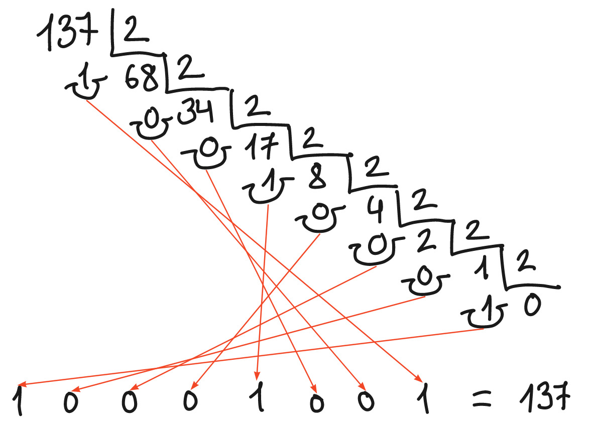
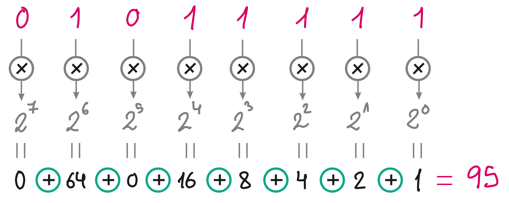
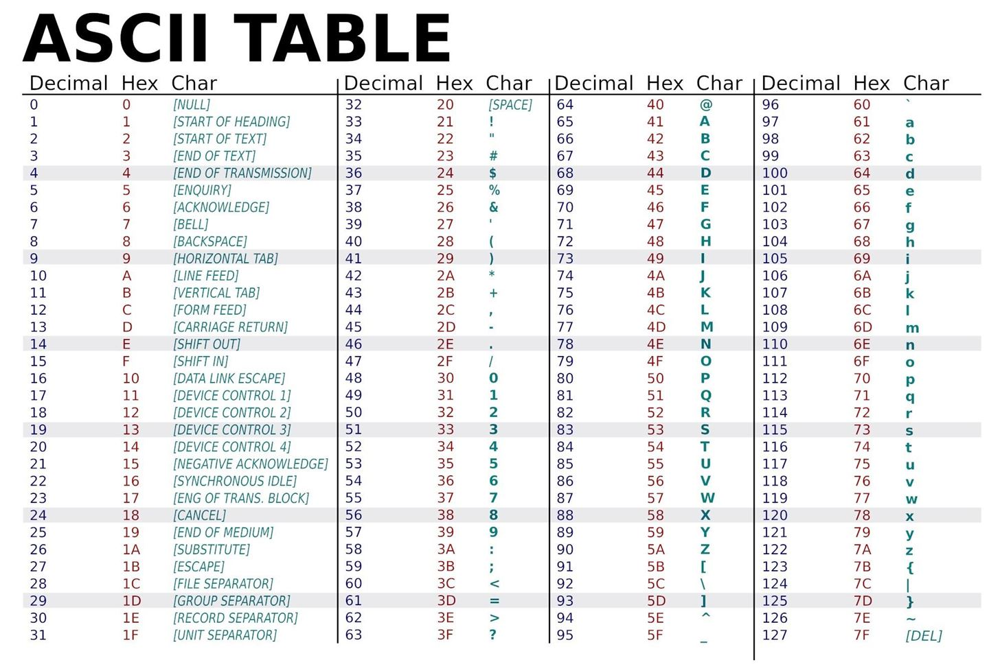

# Codificación binaria

Toda la información que almacena y manipula el ordenador se codifica en binario, es decir, usando solo dos símbolos: `0` y `1`.

## ¿Cómo se codifican los números en binario?

:::info

Para codificar un número natural en binario, se divide sucesivamente entre 2, hasta obtener cociente `0`, y se toman los restos de todas las divisiones empezando por la última.

:::
    
Por ejemplo, la codificación del número `137`, sería:
    

## ¿Cómo se decodifica un número natural de binario a decimal?

:::info

Para decodificar un número natural codificado en binario, se multiplica cada una de sus cifras binarias (`0` o `1`) por su valor (`2` elevado a la posición de la cifra empezando por `0`, desde la derecha), y se suman esos productos.

:::
    
Por ejemplo, el número natural cuya codificación binaria es `11101011`, es el siguiente:
    

    
## ¿Cómo se codifican textos?

:::info

Para codificar un texto en binario, cada carácter<a id="fnr.1" class="footref" href="#fn.1">1</a> se codifica con un número que tiene asociado en una tabla de códigos, y dicho número se codifica en binario.

:::
    
Las tablas de códigos más importantes son: ASCII<a id="fnr.2" class="footref" href="#fn.2">2</a> y Unicode.
    
Esta es la tabla de códigos ASCII:
    

    
Por ejemplo, el texto:
    
`Hello!`
    
se convertiría en los números decimales:
    
`72 101 108 108 111 33`
    
que se codificarían en binario así:
    
`01001000 01100101 01101100 01101100 01101111 00100001`
    
La codificación ASCII utiliza códigos binarios de longitud fija de 8 bits: cada carácter ocupa un byte, aunque su código pudiera representarse en binario con menos dígitos.
    
Obsérvese que existen códigos para los distintos signos ortográficos, incluido el *espacio en blanco* (*space*, ASCII 32). También existe un código para el *cambio de línea* (*line feed*, ASCII 10).

## Notas

<a id="fn.1" href="#fnr.1">1</a>

Se llama *carácter* a cada uno de los signos que componen un texto, incluyendo: letras, números, signos de puntuación, símbolos comunes (asterisco, suma, etc.), espacios en blanco, cambios de línea, etc.

<a id="fn.2" href="#fnr.2">2</a>

ASCII es el acrónimo de *American Standard Code for Information Interchange*. Fue creado a principios de los años sesenta del siglo pasado. Los códigos abarcan desde el 0 hasta el 127, y solo incluían los caracteres utilizados en inglés. Más tarde se creó el ASCII-extendido, incluyendo caracteres de otros idiomas (como la ~ñ~), aprovechando los códigos del 128 al 255.

