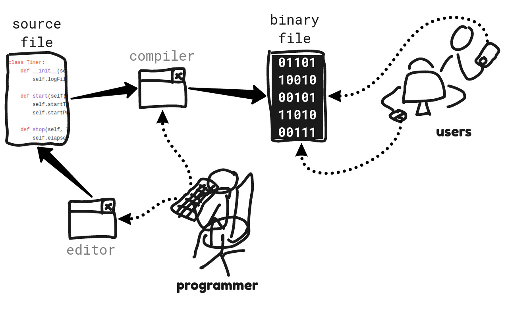
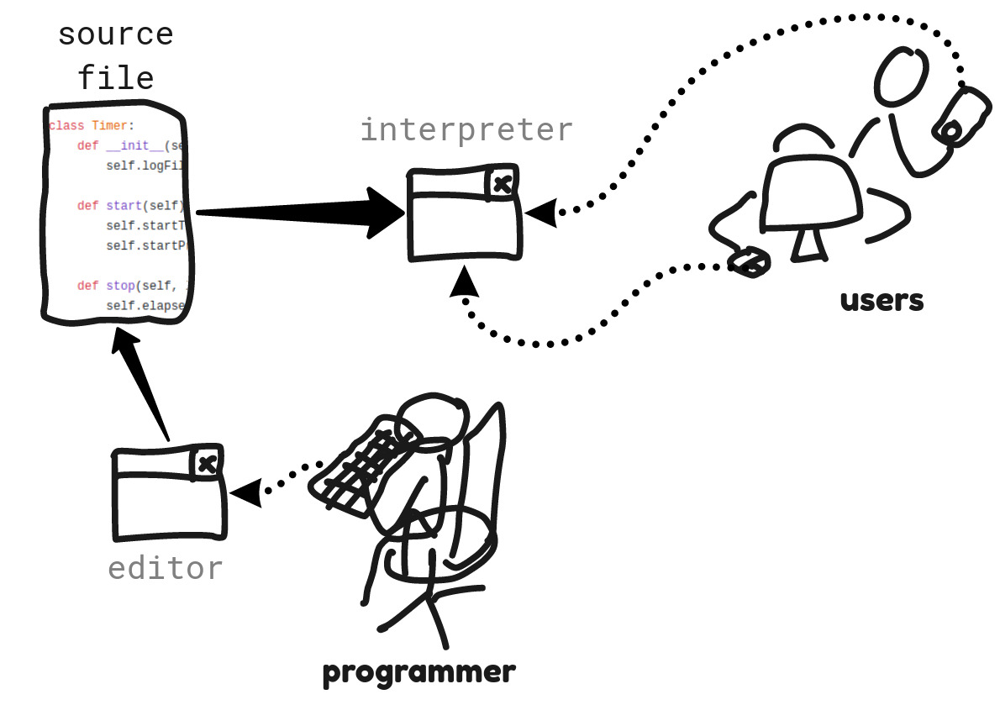

# Lenguajes de programación


## Lenguaje de programación

Lenguaje en el que escribimos los programas para el ordenador. Incluyen un léxico (palabras y símbolos que usamos para construir órdenes), una sintaxis (cómo se pueden combinar esas palabras y símbolos para construir órdenes), y una semántica (cómo se deben ejecutar las órdenes).


## Lenguaje máquina

El lenguaje en que tenemos que escribir las instrucciones que el ordenador tiene que ejecutar se llama *lenguaje máquina*. Es el lenguaje que el ordenador es capaz de ejecutar directamente.


## Lenguaje de alto nivel

Las instrucciones del código máquina son muy simples, por lo que un programa que implemente una funcionalidad compleja requiere una enorme cantidad de dichas instrucciones. Además, es muy difícil traducir una funcionalidad compleja a una secuencia de esas instrucciones simples. Para resolver estos dos problemas se diseñaron los *lenguajes de alto nivel*. Son lenguajes para escribir programas que permiten escribir operaciones más complejas con pocas instrucciones, y más parecidos a los lenguajes naturales.

Los *lenguajes de alto nivel* son lenguajes de programación que la máquina no puede ejecutar directamente, pero que pueden traducirse a lenguaje máquina para su ejecución.

Ejemplo de programa en lenguaje máquina (codificado en binario, y con siglas):

```js
10101010 10010001
00010011 11001010
10010001 00011010
01111010 00000000
00000000 00000000
00000001 01110000
00000000 00000000
00000000 00000000
00000000 00100001
11010000 00000000
00000000 00000000
00000001 01110000
00000000 00000000
00000000 00000000
10111011 10100011
```

```js
push rbp
mov rbp, rsp
mov edi, OFFSET FLAT:.LC0
mov eax, 0
call printf
mov eax, 0
pop rbp
ret
```

El mismo programa escrito en un lenguaje de alto nivel (C++):

```C++
#include <cstdio>

int main()
{
  printf("Hello, World!");
}
```

Algunos ejemplos de lenguajes de alto nivel son: Javascript, Java, C, C++, Python, C#.

En este curso estudiamos cómo escribir programas utilizando JavaScript. La mayoría de las páginas web incluyen algún programa escrito en JavaScript. Por eso se dice que es *el lenguaje de la Web*.


## Módelos de ejecución

:::info

*La CPU solo es capaz de ejecutar código máquina*.

:::

Por lo tanto, para ejecutar un programa escrito en un lenguaje de alto nivel, es necesario traducirlo previamente a código máquina.

-   **Programas compilados**: se traducen completos a código máquina antes de ejecutarlos.
    
    El programador escribe el código fuente y lo guarda en un archivo (*archivo fuente*). Luego lo traduce completo a código máquina utilizando un programa llamado *compilador*. El *compilador* genera un archivo nuevo con el código máquina (*archivo binario* o *archivo ejecutable*). El programador distribuye el *archivo ejecutable* a los usuarios. Los usuarios solo necesitan el *archivo ejecutable*, porque sus ordenadores pueden ejecutar directamente ese archivo (que contiene el código máquina).
    
    

-   **Programas interpretados**: se traducen y ejecutan línea a línea.
    
    El programador escribe el código fuente y lo guarda en un archivo (*archivo fuente*). El programador distribuye el *archivo fuente* a los usuarios. Los usuarios, además del código fuente, necesitan un programa que traduzca y ejecute el código fuente, porque sus ordenadores no pueden ejecutar directamente el código fuente. Dicho programa se llama *intérprete*. El *intérprete* va intercalando la traducción y la ejecución (traduce una línea del código fuente, la ejecuta, y luego pasa a la siguiente línea).
    
    

Las principales diferencias entre ambos modelos de ejecución son las siguientes:

-   Para el usuario, la ejecución de los programas compilados es mucho más rápida, porque la traducción se hizo completa antes de la ejecución, mientras que en los programas interpretados, entre la ejecución de una línea y la de la siguiente, es necesario realizar la traducción de dicha siguiente línea.
-   Para el programador, la escritura de los programas interpretados es más rápida. El programador tiene que ejecutar continuamente el programa que está escribiendo para comprobar que funciona correctamente. En el caso de un programa compilado, por cada pequeño cambio que haga tiene que recompilar el programa completo. En el caso de un programa interpretado, no es necesario esperar el tiempo de la compilación.
-   En cuanto a la distribución del software, es una ventaja para el programa compilado el no tener que distribuir un programa adicional para interpretar el código. Sin embargo, es una ventaja para el programa interpretado no tener que generar distintas versiones del archivo ejecutable (la compilación no es la misma en todos los ordenadores ni en todos los sistemas operativos).
-   Es más fácil conservar la privacidad del código fuente en el caso de los programas compilados, porque solo se distribuyen los archivos ejecutables.
    
    Los programas escritos en JavaScript suelen ser programas interpretados.


## Sentencias

:::info

Las **sentencias** en un lenguaje de programación son las unidades mínimas ejecutables.

:::

Es decir, una sentencia es una orden que damos al ordenador para que la ejecute.

Podríamos decir que un programa es una secuencia de sentencias que el ordenador tiene que ejecutar<sup><a id="fnr.1" class="footref" href="#fn.1">1</a></sup>.

En el lenguaje máquina, a las unidades mínimas de ejecución se les llama *instrucciones*.

Normalmente, **escribimos cada sentencia en una línea**. Pero, a veces, la sentencia es compleja, y preferimos escribirla en varias líneas para que sea más fácil leerla. En algunos lenguajes, es posible escribir varias sentencias en una línea, pero no solemos hacerlo, porque el código resulta más difícil de leer.

En JavaScript, las sentencias terminan con *punto y coma* (`;`).

Ejemplos de sentencias en varios lenguajes (todas las sentencias hacen lo mismo: escribir un saludo en la pantalla):

```cpp title="C++"
std::cout << "Hello, world!\n";
```

```python title="Python"
print("Hello, world!")
```

```js title="JavaScript"
document.write("Hello, world!");
```

## Footnotes

<sup><a id="fn.1" class="footnum" href="#fnr.1">1</a></sup> En realidad, esta definición de programa es demasiado simple. Los lenguajes nos permiten usar construcciones más complejas que las sentencias, para establecer el orden en que se deben ejecutar las sentencias, para dar nombres a grupos de sentencias, y otras similares. Esas construcciones son también parte, y parte importante, en los programas. Por otro lado, esta forma de entender los programas (como secuencias de sentencias) es sólo una de las posibles. También se puede considerar que un programa es un conjunto de definiciones de expresiones que hay que evaluar.
