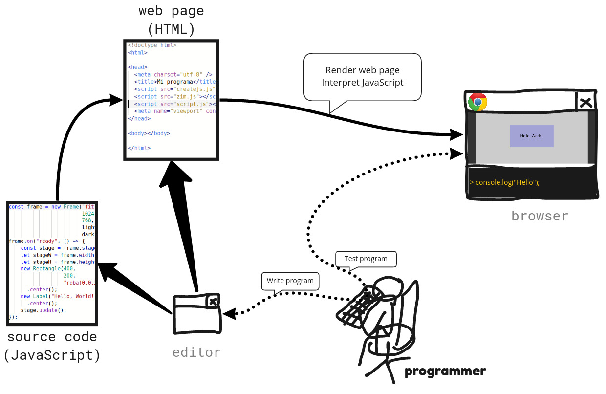
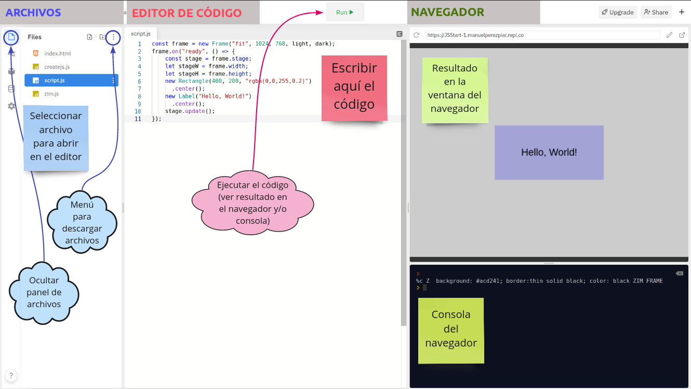

# Herramientas

## Herramientas esenciales

Para crear programas, un programador necesita como mínimo las siguientes
herramientas, que son también programas:

  - **Editor de código**: programa editor de textos especializado para
    escribir código fuente.
    
    Estos editores detectan automáticamente los errores de escritura,
    completan automáticamente las palabras que empezamos a escribir, y
    formatean el texto de forma que sea más fácil de leer.

  - **Compilador** o **Intérprete**: programa que se utiliza para
    compilar o interpretar otros programas.
    
    JavaScript es un lenguaje interpretado, y, por tanto, utilizaremos
    un intérprete.
    
    El intérprete que utilizamos para ejecutar los programas escritos en
    JavaScript es un navegador de Internet. Los navegadores de Internet
    (Edge, Firefox, Safari, Chrome,…) incluyen un intérprete de
    JavaScript, porque muchas páginas web incluyen programas escritos en
    ese lenguaje, que deben ejecutarse al visitar la página web en la
    que dichos programas están *incrustados*. De hecho, esa es la manera
    más habitual de ejecutar un programa escrito en JavaScript:
    visitando una página web en la que *incrustamos* el programa.

## Navegador de Internet

Los **navegadores de Internet** son los programas que utilizamos para
ver las páginas web (por ejemplo, para buscar cosas en Google, o para
leer nuestro correo electrónico, o para leer las noticias en un
periódico online).

Algunos navegadores de Internet muy utilizados son: Edge, Firefox,
Safari, Chrome.

Pero, además, los navegadores de Internet son también **intérpretes de
Javascript**.

Esto es así porque muchas páginas web incluyen programas escritos en ese
lenguaje, que deben ejecutarse cuando se carga la página web. De hecho,
JavaScript se inventó para poder hacer las páginas web más interactivas,
justamente incluyendo programas que se ejecuten al leer la página.

Por lo tanto, para escribir un programa en JavaScript, lo escribiremos
en un editor de código, lo incrustaremos en una página web, y
ejecutaremos el programa abriendo dicha página en el navegador de
Internet. Por eso, nuestros programas estarán siempre formados por al
menos dos archivos: la página web (archivo `html`) y el programa
propiamente dicho (archivo `js`). Aunque sería posible escribir el
código directamente en el archivo `html`, en los ejercicios
mantendremos separados en sendos archivos la página web y el programa en
JavaScript.



Los navegadores de Internet incluyen una utilidad llamada **consola**.
Es una ventana en la que podemos escribir órdenes en JavaScript, para
que el navegador las ejecute inmediatamente.

:::tip

Prueba a abrir la consola del navegador, pulsando `Ctrl+Shift+I`, y
escribe

``` javascript
document.bgColor = "red";
```

Para volver a ver la página como al principio, simplemente actualiza la
página (`F5`).

:::

## Otras herramientas

  - **Depurador** (*debugger*): programa que permite ejecutar otro
    programa paso a paso, para facilitar la localización y corrección de
    errores.

  - **Control de versiones**: programa que sirve para controlar qué
    cambios se hacen al programa, y poder deshacerlos, guardar distintas
    versiones, etc.

  - **Repositorio**: programa que almacena programas.

## Entorno de Desarrollo Integrado

Un Entorno de Desarrollo Integrado (*IDE*, por sus siglas en inglés,
*Integrated Development Environment*) es un programa que incluye todas
las herramientas anteriores.

A continuación se muestra un ejemplo de *IDE* online (es decir, que se
puede usar directamente en el navegador, sin necesidad de instalar nada
localmente) llamado [Replit](http://www.repl.it).



Otros IDE online que pueden utilizarse para hacer los ejercicios son los
siguientes:

  - [Glitch](http://glitch.com)
  - [StackBlitz](https://stackblitz.com)
