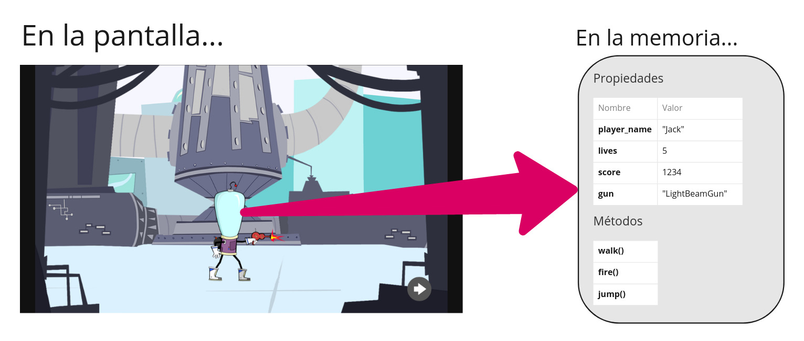

# Objetos

:::info

Un **objeto** es la representación en la memoria, de una entidad o
concepto del mundo real que queremos utilizar en nuestro programa.

Los **objetos gráficos** son objetos que podemos dibujar en la página
web (como un círculo, un rectángulo,…).

:::

:::info

Un objeto tiene:

  - **propiedades** (o atributos): características del objeto, o bien
    objetos contenidos en el objeto;
  - **métodos**: operaciones que puede realizar el objeto, o que podemos
    realizar con el objeto.

:::

:::info

Cada propiedad tiene:

  - **nombre**: que identifica la propiedad;
  - **valor**: que tiene la propiedad en este objeto concreto.

:::

Por ejemplo, un círculo tiene una propiedad llamada `radius`, que es el
radio del círculo, y que tendrá un valor concreto.

:::info

Cada método tiene:

  - **nombre**: que identifica al método;
  - **cuerpo**: instrucciones que hay que ejecutar para realizar la
    operación;
  - **parámetros** (opcional): datos que el objeto utiliza para realizar
    la operación; se escriben entre paréntesis a continuación del
    nombre, y separados entre sí por comas.

:::

Por ejemplo, un círculo tiene un método llamado `mov`, que mueve el
círculo, y necesita dos parámetros: la distancia horizontal, y la
distancia vertical, ambas en píxeles, que queremos mover el círculo.
Así, `mov(100, 50)`, movería el círculo 100 píxeles hacia la derecha y
50 píxeles hacia abajo, desde su posición actual.
