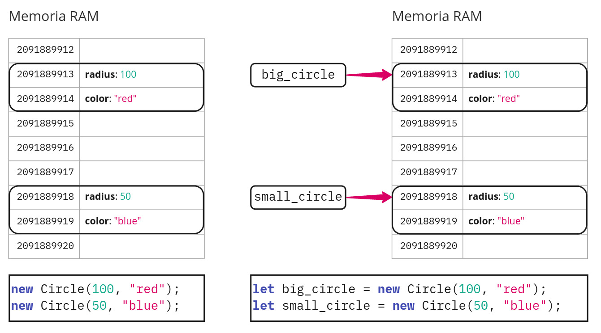

# Variables

Los objetos se guardan en la memoria. Se puede decir que un objeto es un lugar de almacenamiento en la memoria. Pero, ¿cómo acceder a ellos después de haberlos creado?


## **¿Qué es una variable?**

:::info

Una **variable** es un objeto con nombre<sup><a id="fnr.1" class="footref" href="#fn.1">1</a></sup>.

:::

Se suele hablar de *crear una variable* porque, normalmente, ponemos el nombre en la misma sentencia en la que creamos el objeto. El objeto se almacena en la memoria. Para acceder al objeto (para ver o modificar sus propiedades, o para ejecutar sus métodos), podemos utilizar su nombre.

Para crear una variable utilizamos la palabra clave `let`.

Por ejemplo, la siguiente sentencia crea una variable que almacena un objeto de clase círculo con el nombre `c`:

```js
  let c = new Circle(100, "red");
```




## **¿Qué nombres se pueden<sup><a id="fnr.2" class="footref" href="#fn.2">2</a></sup> poner a las variables?**

Podemos poner cualquier nombre que cumpla estas condiciones:

-   Solo puede contener letras, números, el guión bajo (`_`) y el signo de dólar (`$`).
-   Debe comenzar con una letra.
-   No puede ser ninguna de las *palabras reservadas* del lenguaje (palabras que ya tienen un significado definido en el lenguaje), como `new` o `let`.<sup><a id="fnr.3" class="footref" href="#fn.3">3</a></sup>


## **¿Qué nombres debemos<sup><a id="fnr.4" class="footref" href="#fn.4">4</a></sup> poner a las variables?**

Es importante elegir bien los nombres que ponemos a las variables.

Los nombres de las variables deben cumplir las siguientes normas de estilo, para que ayuden a comprender mejor el código:

-   El nombre de una variable debe indicar el significado del objeto en el programa.
-   Los nombres deben ser pronunciables.
-   Se deben evitar caracteres que se confundan fácilmente.
-   Los nombres de las variables deben empezar con letra minúscula.
-   Para separar las palabras en una variable, usamos el guión bajo<sup><a id="fnr.5" class="footref" href="#fn.5">5</a></sup>.


## **¿Cómo utilizamos una variable?**

Una vez creada una variable, podemos acceder al objeto almacenado en dicha variable escribiendo su nombre.

Para acceder a las propiedades o métodos del objeto almacenado en una variable, escribimos el nombre de la propiedad o del método, a continuación del nombre de la variable, separado por un **punto**.

Por ejemplo, en el siguiente programa creamos dos círculos, que se almacenan en sendas variables, y, a continuación, modificamos una propiedad de uno de los círculos, y ejecutamos uno de los métodos del otro:

```js
  let big_circle = new Circle(500, "red");
  let small_circle = new Circle(100, "blue");
  big_circle.color = "yellow";
  small_circle.mov(100, 100);
```


## **¿Cómo guardamos en una variable un dato introducido por el usuario?**

Vimos que podemos recibir información del usuario con la orden `prompt`, que abre una ventana con un mensaje y un cuadro en el que el usuario puede escribir.

Podemos almacenar en una variable lo que el usuario escriba, de esta forma:

```js
  let nombre = prompt("Escriba su nombre");
```

## Footnotes

<sup><a id="fn.1" class="footnum" href="#fnr.1">1</a></sup>

 El término técnico para lo que nosotros llamamos *nombre* es *identificador*. Los mensajes de error del intérprete utilizan ese término para referirse al nombre de una variable (y de otras entidades con nombre en los programas, como las clases o las funciones).

<sup><a id="fn.2" class="footnum" href="#fnr.2">2</a></sup>

 Aquí nos referimos a *reglas sintácticas*: si no se cumplen, el programa no funciona.

<sup><a id="fn.3" class="footnum" href="#fnr.3">3</a></sup>

 Estas son las palabras reservadas: `break`, `case`, `class`, `catch`, `const`, `continue`, `debugger`, `default`, `delete`, `do`, `else`, `export`, `extends`, `finally`, `for`, `function`, `if`, `import`, `in`, `instanceof`, `let`, `new`, `return`, `super`, `switch`, `this`, `throw`, `try`, `typeof`, `var`, `void`, `while`, `with`, `yield`, `enum`, `implements`, `package`, `protected`, `static`, `interface`, `private`, `public`, `abstract`, `boolean`, `byte`, `char`, `double`, `final`, `float`, `goto`, `int`, `long`, `native`, `short`, `synchronized`, `transient`, `volatile`.

<sup><a id="fn.4" class="footnum" href="#fnr.4">4</a></sup>

 Aquí nos referimos a *reglas de estilo*: aunque no las cumplamos, el programa funciona, pero el código será más difícil de entender.

<sup><a id="fn.5" class="footnum" href="#fnr.5">5</a></sup>

 Otro sistema muy utilizado para separar las palabras en los nombres es comenzar con mayúscula la segunda y siguientes palabras. Por ejemplo, en lugar de *big<sub>circle</sub>*, escribiríamos `bigCircle`.
