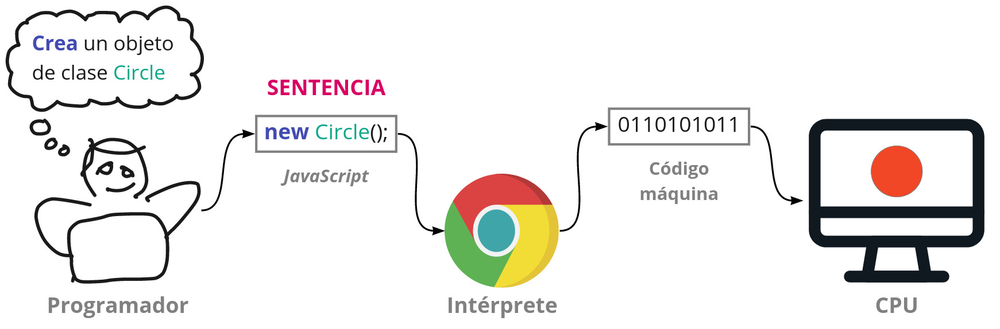
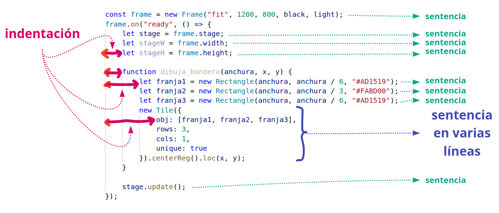
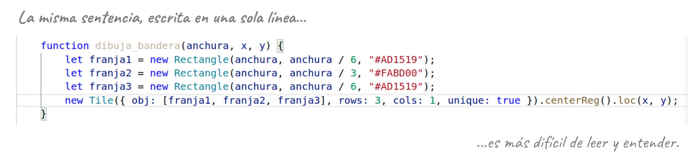

# Sentencias


## **¿Qué es una sentencia?**

:::info

Una *sentencia* es una orden o instrucción que damos al ordenador para que la ejecute.

:::

La acción más básica que se puede expresar en un lenguaje de programación es una *sentencia*.

La sentencia expresa, en JavaScript, una orden que damos al ordenador. En realidad, la orden se la damos al intérprete, para que él la traduzca a lenguaje máquina, y le dé al ordenador las órdenes en lenguaje máquina correspondientes a la orden que nosotros hemos escrito en JavaScript.

Podría decirse que un programa es una lista de sentencias que escribimos y damos al ordenador para que las ejecute.

Aunque los lenguajes de programación de alto nivel intentan acercarse a nuestros lenguajes naturales, siguen quedándose muy lejos de ellos. Para entender adecuadamente las sentencias, es conveniente entenderlas como órdenes que damos al ordenador, y ser capaces de traducirlas a nuestro lenguaje natural. Un poco más adelante veremos cómo traducir a nuestro lenguaje las órdenes que escribimos en JavaScript. El objetivo es doble: ser capaces de entender un programa escrito en JavaScript (por ser capaces de traducir de JavaScript a nuestro lenguaje natural), y ser capaces de escribir programas en JavaScript (por ser capaces de traducir de nuestro lenguaje natural a JavaScript).




## **¿Cómo se escribe una sentencia?**

Cada *sentencia* tiene su propia **sintaxis** (reglas sobre cómo debe escribirse). Es necesario aprender cómo se escribe cada tipo de sentencia. Si la *sentencia* no se escribe de acuerdo con su sintaxis, el intérprete no será capaz de ejecutarla. En la mayoría de los casos, el intérprete nos informará de ello con un mensaje de error en la consola.

Reglas de estilo (no son obligatorias, pero sí muy recomendables para que los programas sean más fáciles de entender):

-   Escribir cada sentencia en una línea distinta.
-   Respetar las indentaciones (los espacios en blanco al comienzo de las líneas), de modo que las sentencias queden alineadas según la estructura del programa<sup><a id="fnr.1" class="footref" href="#fn.1">1</a></sup>.
-   En general, conviene intentar que las sentencias no sean muy largas (no más de 80-100 caracteres). En algunos casos (como en métodos con muchos argumentos), conviene escribir la sentencia en varias líneas, alineando correctamente el comienzo de cada línea).






## **¿Qué tipos de sentencias existen?**

De momento, hemos estudiado los siguientes tipos de sentencias:

-   Crear un objeto de cierta clase:
    
    ```js
            new Circle(100, "red");
            // Crea un objeto de clase Circle, pasando 100 y "red" como argumentos al constructor.
    ```

-   Dar nombre a cierto objeto (es decir, crear una variable):
    
    ```js
            let c = new Circle(100, "red");
            // Crea un objeto de clase Circle, pasando 100 y "red" como argumentos al constructor,
            // y ponle nombre "c".
    ```

-   Cambiar el valor de una propiedad de un objeto:
    
    ```js
            c.radius = 200;
            // Cambia el valor de la propiedad "radius" del objeto llamado "c" a 200.
    ```

-   Ejecutar un método de un objeto:
    
    ```js
            c.center();
            // Ejecuta el metodo "center" del objeto llamado "c".
    ```

Obsérvese que todas las sentencias anteriores deben terminar con un *punto y coma* (`;`) <sup><a id="fnr.2" class="footref" href="#fn.2">2</a></sup>.

Más adelante estudiaremos algunos otros tipos de sentencias.

Obsérvese que las sentencias se expresan en castellano con verbos en imperativo, porque son órdenes.

El verbo de cada orden se expresa en JavaScript mediante una *palabra clave*, o mediante un signo que llamamos *operador*. En los tipos de sentencias anteriores, dichas *palabras clave* y dichos *operadores* serían:

-   *Crea* (un objeto nuevo de clase&#x2026;): palabra clave `new`.
-   *Nombra* (con cierto nombre a cierto objeto): palabra clave `let` (o `var`).
-   *Cambia* (el valor de cierta propiedad): operador `=`.
-   *Ejecuta* (cierto método): operador `()`.

## Footnotes

<sup><a id="fn.1" class="footnum" href="#fnr.1">1</a></sup>

 La mayoría de los editores de código tienen funciones de *autoformato* que mantienen automáticamente las indentaciones.

<sup><a id="fn.2" class="footnum" href="#fnr.2">2</a></sup>

 Los intérpretes de JavaScript son bastante flexibles con esta regla: si no se cumple, pero es posible distinguir el final de la sentencia por el contexto, el programa se ejecutará sin problema. Pero no es recomendable dejar de escribir el `;` del final de cada sentencia.
