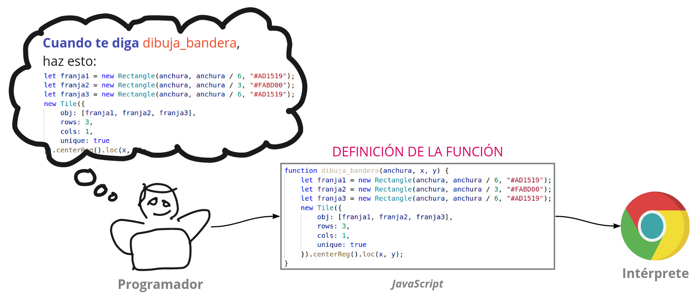
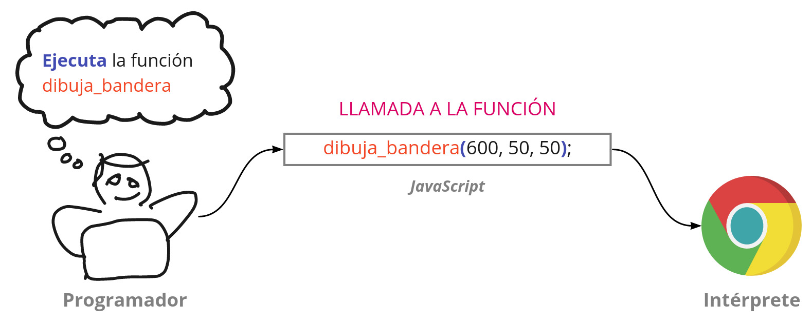
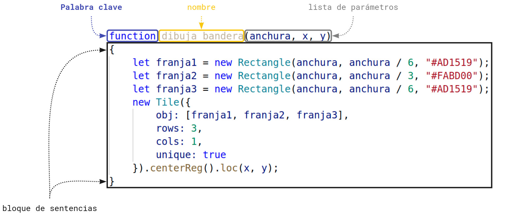
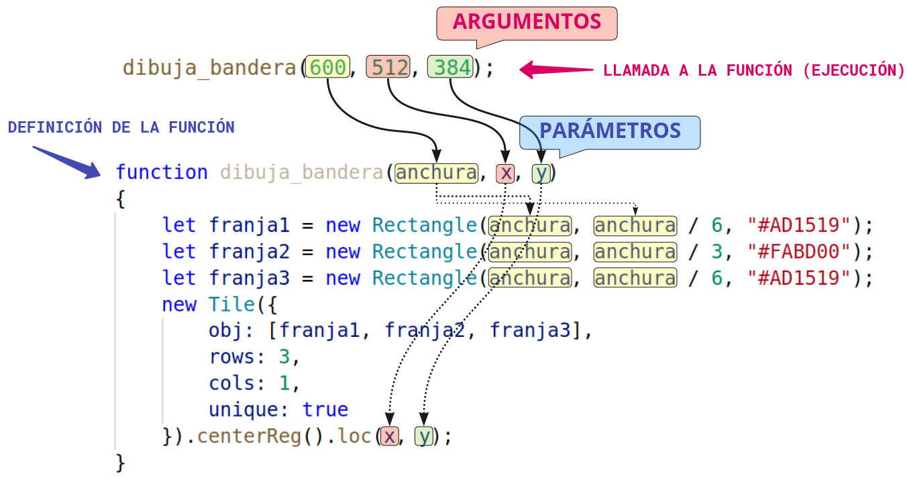
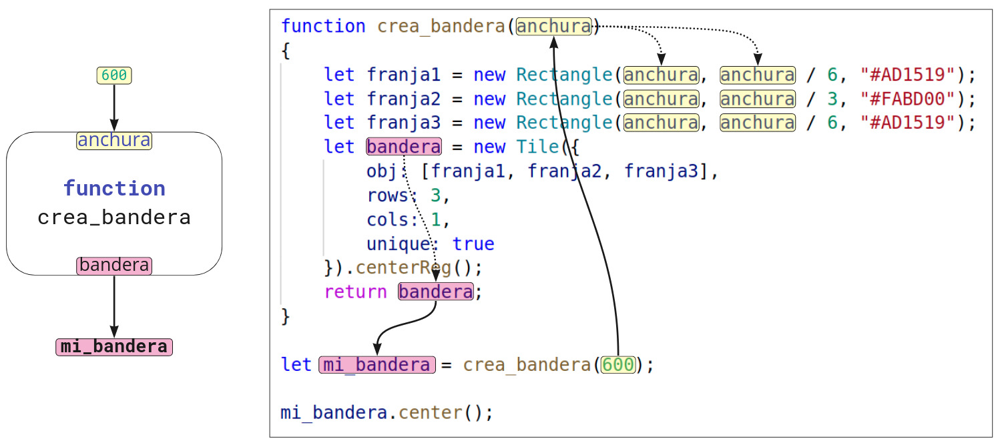

# Funciones


## **¿Qué es una función?**

:::info

Una **función** es una secuencia de sentencias que podemos ejecutar con una sola expresión.

:::

La expresión mediante la que ejecutamos una función se llama *invocación* o *llamada* a la función.

Es posible poner nombre a una función. También es posible crear funciones sin nombre.

Antes de poder usar la función (es decir, ejecutarla, o, lo que es lo mismo, *llamarla*), es necesario *definir* la función.

Cuando definimos la función en nuestro programa, el ordenador no la ejecuta: solo almacena en la memoria la definición de la función (las sentencias que tendrá que ejecutar) para poder ejecutarla cuando se lo digamos (mediante una *llamada* a la función).

Al definir una función estamos, en cierto modo, extendiendo el lenguaje: añadiendo palabras que podremos después usar en nuestros programas. Pero solo podemos usar las funciones en los programas en los que también se incluye su definición. Es decir, no podemos usar en un programa una función definida en otro programa distinto<sup><a id="fnr.1" class="footref" href="#fn.1">1</a></sup>.






## **¿Por qué son útiles las funciones?**

La funciones son útiles por tres razones:

-   **Evitan repetir código**.
    
    Es muy frecuente que un programa tenga que repetir las mismas acciones muchas veces. Las funciones nos permiten escribir las sentencias correspondientes una sola vez, y repetir su ejecución mediante una expresión muy sencilla.

-   **Facilitan la lectura del programa**.
    
    Poder dividir las sentencias en bloques, ayuda a organizar el código, y hace más fácil comprenderlo.

-   **Facilitan la construcción del programa**.
    
    El hecho de poder dividir las sentencias del programa en bloques, a los que podemos poner un nombre que exprese lo que cada bloque hace, facilita diseñar la resolución de los problemas subdividiéndolos en problemas más pequeños, y componiendo las resoluciones de esos problemas parciales para construir la resolución del problema completo. Más adelante veremos esto con mayor extensión y profundidad.


## **¿Cómo se crea una función?**

Para crear (o definir) una función se utiliza una expresión con la siguiente sintaxis:

```js
  function nombre (parametros)
  {

      sentencia1;
      sentencia2;
      ...
  }
```

La definición de una función tiene cuatro partes:

-   **Palabra clave `function`**: indica que se está creando una función.

-   (Opcional) **Nombre de la función**: el nombre que queramos dar a la función. Las reglas para los nombres de funciones son los mismos que para las variables. Es opcional.

-   **Lista de parámetros**: los parámetros son datos con los que podemos configurar el comportamiento de la función. Podemos darles los nombres que queramos. La lista de parámetros puede estar vacía, pero no podemos omitir los paréntesis. Los parámetros se separan por comas.

-   **Cuerpo de la función**: es la secuencia de sentencias que se ejecutarán cuando *invoquemos* a la función. Se escribe entre llaves.

Ejemplo de definición de una función:

```js
function dibuja_bandera(anchura, x, y)
{
    let franja1 = new Rectangle(anchura, anchura/6, "#AD1519");
    let franja2 = new Rectangle(anchura, anchura/3, "#FABD00");
    let franja3 = new Rectangle(anchura, anchura/6, "#AD1519");
    new Tile({
              obj: [franja1, franja2, franja3],
              rows: 3,
              cols: 1,
              unique: true
    }).centerReg().loc(x, y);
}
```

Al ejecutar esta función, se ejecutan las sentencias que forman su *cuerpo*, y, por consiguiente, se dibuja una bandera de España con la anchura indicada en el primer parámetro, en las coordenadas indicadas en los parámetros `x` e `y`.

Un programa que solo contuviera la definición anterior no haría nada, porque el intérprete no ejecuta la definición: solo la almacena en la memoria para cuando tenga que ejecutarla.




## **¿Cómo se invoca una función?**

:::info

Para invocar una función, se escribe su nombre, seguido de la lista de valores (*argumentos*) que queremos dar a sus parámetros entre paréntesis.

:::

Para ejecutar una función que hayamos definido en el programa, es necesario *invocarla* (o *llamarla*), mediante la expresión descrita arriba.

Ejemplo de invocación de la función definida en el ejemplo anterior:

```js
  dibuja_bandera(600, 512, 384);
```

La ejecución de la llamada a la función tiene dos pasos:

1.  Se asigna a los parámetros los valores indicados entre paréntesis en la invocación<sup><a id="fnr.2" class="footref" href="#fn.2">2</a></sup>. Esta asignación se realiza correlativamente (es decir, el primer valor se asigna al primer parámetro, el segundo al segundo, etc.).

2.  Se ejecutan las sentencias que forman el *cuerpo* de la función.

Por ejemplo, al ejecutar la invocación del ejemplo anterior, se realizan las siguientes asignaciones:

-   `anchura` = `600`,
-   `x` = `512`,
-   `y` = `384`

Y, a continuación se ejecutan las sentencias del *cuerpo*. También se puede pensar que se ejecutan las sentencias sustituyendo los parámetros por los valores dados en la llamada<sup><a id="fnr.3" class="footref" href="#fn.3">3</a></sup>:

```js
  let franja1 = new Rectangle(600, 600/6, "#AD1519");
  let franja2 = new Rectangle(600, 600/3, "#FABD00");
  let franja3 = new Rectangle(600, 600/6, "#AD1519");
  new Tile({
      obj: [franja1, franja2, franja3],
      rows: 3,
      cols: 1,
      unique: true
  }).centerReg().loc(512, 384);
```




## **¿Puede la función producir un resultado?**

Un función puede *producir* un resultado<sup><a id="fnr.4" class="footref" href="#fn.4">4</a></sup>. Si la función produce un resultado, la llamada a la función representa a dicho resultado en cualquier expresión en que se use.

Para producir un resultado, la función debe utilizar en su cuerpo una sentencia `return`. La ejecución de dicha sentencia tiene dos efectos:

1.  Termina la ejecución de la función, devolviendo el control al lugar desde el que se la llamó.
2.  Establece el valor del resultado de la función, que sustituirá a la llamada en la expresión en que esta apareciera.

Por ejemplo. La siguiente función es muy similar a la anterior. Pero, en lugar de dibujar una bandera, crea un objeto que contiene a la bandera, y produce dicho objeto como resultado.

```js
  function crea_bandera(anchura)
  {
      let franja1 = new Rectangle(anchura, anchura/6, "#AD1519");
      let franja2 = new Rectangle(anchura, anchura/3, "#FABD00");
      let franja3 = new Rectangle(anchura, anchura/6, "#AD1519");
      let bandera = new Tile({
                obj: [franja1, franja2, franja3],
                rows: 3,
                cols: 1,
                unique: true
      }).centerReg();
      return bandera;
  }
```

La sentencia,

```js
  return bandera;
```

hace que la función termine, y establece el objeto `bandera` como resultado de la función.

Ahora podemos utilizar dicho resultado del siguiente modo:

```js
  let b = crea_bandera(600);
  b.center();
```

También podíamos haber escrito:

```js
  crea_bandera(600).center();
```

Ya que la llamada a la función representa al resultado de la misma, que es un objeto gráfico (de clase `Tile`), que tiene el método `center`.



## Footnotes

<sup><a id="fn.1" class="footnum" href="#fnr.1">1</a></sup>

 Existe la posibilidad de crear *módulos*: programas que contienen definiciones de funciones, que podemos *importar* en nuestro programa. Se trata de *librerías* de funciones, definidas en archivos distintos del archivo del programa que escribimos. Pero es necesario indicar al navegador cómo puede acceder a las definiciones de esas funciones. Lo que es claro es que el navegador no podrá ejecutar una función si no conoce su definición, es decir, si no sabe qué sentencias forman la función.

<sup><a id="fn.2" class="footnum" href="#fnr.2">2</a></sup>

 A los valores que se pasan a la función al llamarla, como valores para sus parámetros, se les llama *argumentos*.

<sup><a id="fn.3" class="footnum" href="#fnr.3">3</a></sup>

 En realidad, sería más exacto decir que se sustituyen los parámetros por los argumentos, ya que los argumentos pueden ser nombres de variables, y, en ese caso, los parámetros, dentro del cuerpo de la función, actúan como referencias a esas variables. Es decir, hacen referencia a los mismos objetos a los que hacen referencia los nombres de variables que hemos pasado como argumentos.

<sup><a id="fn.4" class="footnum" href="#fnr.4">4</a></sup>

 A dicho resultado se le suele llamar *valor devuelto* por la función.
