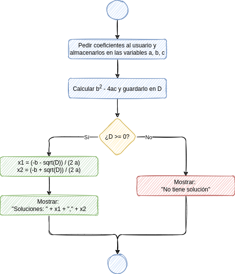

# Control de flujo

## Flujo de ejecución

Dijimos que un programa es una secuencia de sentencias que el ordenador debe ejecutar.

El orden en que el ordenador ejecuta dichas sentencias se llama *flujo de ejecución*.

Normalmente, las sentencias se ejecutan en el orden en que están escritas. Las sentencias que permiten alterar ese orden de ejecución, determinando quė sentencias se ejecutan en cada momento, se llaman *sentencias de control de flujo*.

Las sentencias condicionales son sentencias de control de flujo, porque determinan que ciertas sentencias se ejecuten o no.

Las sentencias condicionales establecen una bifurcación en el flujo de ejecución, porque definen dos posibles caminos entre los que se elegirá dependiendo de cierta condición.

## Diagramas de flujo

El flujo de ejecución de un programa puede representarse gráficamente mediante un *diagrama de flujo*.

En un diagrama de flujo, las sentencias se representan mediante rectángulos, y el flujo de ejecución mediante flechas que unen dichos rectángulos indicando el orden en que se ejecutan.

Una sentencia condicional tiene dos partes: la comprobación de cierta condición, y la secuencia de sentencias que se ejecutarán en caso de que la condición se cumpla. La comprobación de la condición se representa con un rombo.

Por ejemplo, un programa para calcular las soluciones de una ecuación de segundo grado podría tener el siguiente diagrama de flujo:

