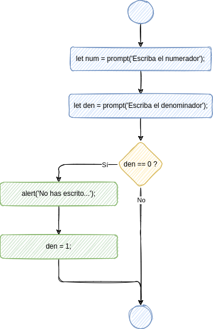

# Sentencia if

:::info

La sentencia `if` es una sentencia condicional mediante la que le decimos la ordenador que compruebe cierta condición y ejecute un bloque de sentencias en el caso de que dicha condición se cumpla.

:::


## Sintaxis

La sintaxis de la sentencia `if` es la siguiente:

```javascript
if (condición) {
    ejecutar_si_se_cumple;
}
```

Observa que:

-   la condición se escribe entre **paréntesis**;
-   las sentencias se escriben entre **llaves**.

Más adelante veremos qué condiciones se pueden comprobar.


## Ejemplo

```javascript
let num = prompt('Escriba el numerador');
let den = prompt('Escriba el denominador');
if (den == 0) {
    alert('No has escrito denominador, o has escrito 0. Usaremos 1.');
    den = 1;
}
alert('División: ' + num/den);
```

El diagrama de flujo correspondiente sería el siguiente:


