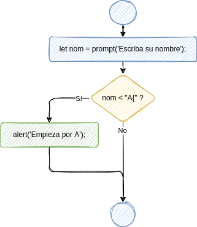

# Sentencia if

:::info

La sentencia `if` es una sentencia condicional mediante la que le decimos la ordenador que compruebe cierta condición y ejecute un bloque de sentencias en el caso de que dicha condición se cumpla.

:::


## Sintaxis

La sintaxis de la sentencia `if` es la siguiente:

```javascript
if (condición) {
    ejecutar_si_se_cumple;
}
```

Observa que:

-   la condición se escribe entre **paréntesis**;
-   las sentencias se escriben entre **llaves**.

Más adelante veremos qué condiciones se pueden comprobar.


## Ejemplo

```javascript
let num = prompt('Escriba el numerador');
let den = prompt('Escriba el denominador');
if (den == 0) {
    alert('No has escrito denominador, o has escrito 0. Usaremos 1.');
    den = 1;
}
alert('División: ' + num/den);
```

El diagrama de flujo correspondiente sería el siguiente:


## Ejercicios

1.  📝 Dibuja el diagrama de flujo correspondiente al siguiente fragmento de código:
    
    ```javascript
    let x = 5;
    if (x < 0) {
      document.write("Negativo");
    }
    ```

2.  📝 Dibuja el diagrama de flujo correspondiente al siguiente fragmento de código:
    
    ```javascript
    let x = prompt("Escriba un número");
    if (x < 0) {
      x = -x;
    }
    document.write(x);
    ```

3.  📝 💻 Escribe el código correspondiente al siguiente diagrama de flujo:
    
    

4.  📝 💻 Escribe el código correspondiente al siguiente diagrama de flujo:
    
    

5.  📝 Dibuja el diagrama de flujo correspondiente al siguiente fragmento de código:
    
    ```javascript
    let x = prompt("Su número");
    if (x < 0) {
      document.write("Negativo");
    }
    if (Math.abs(x) > 100) {
      document.write("Tres cifras");
    }
    ```

6.  📝 Dibuja el diagrama de flujo correspondiente al siguiente fragmento de código:
    
    ```javascript
    let x = prompt("Su número");
    if (x < 1) {
      document.write("Pequeño");
      if (x > -1) {
        document.write("Valor absoluto menor que 1");
      }
    }
    ```

7.  📝 Dibuja el diagrama de flujo correspondiente al siguiente fragmento de código:
    
    ```javascript
    let x = 5;
    if (x < 0) {
      document.write("Negativo");
    }
    ```

8.  📝 💻 ¿Qué número aparecerá en la consola al ejecutar el siguiente código?
    
    ```javascript
    let x = 3;
    if (x < 5) {
      x = x + 1;
      if (x > 10) {
        x = 2*x;
      }
      x = x - 1;
    }
    console.log(x);
    ```

9.  📝 💻 ¿Qué número aparecerá en la consola al ejecutar el siguiente código?
    
    ```javascript
    let x = 3;
    if (x < 5) {
      x = 5*x;
    }
    if (x > 10) {
      x = x - 1;
    }
    console.log(x);
    ```
