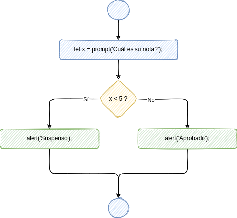
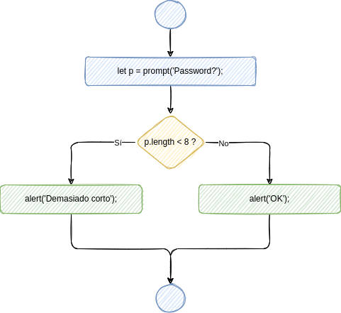
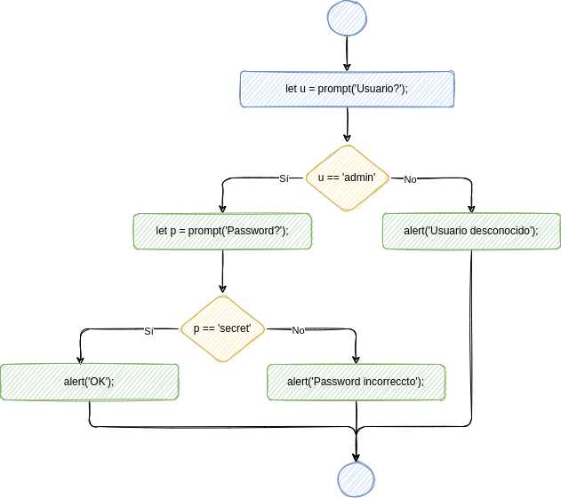
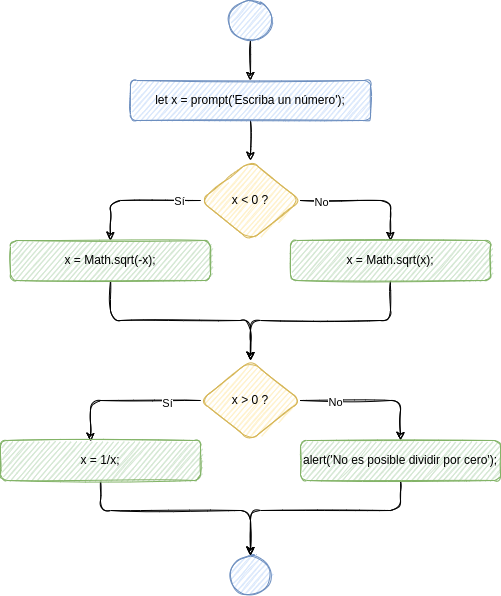

# Sentencia if/else

:::info

La sentencia `if/else` es una sentencia condicional, mediante la cual le decimos al ordenador que compruebe una condición, y ejecute cierto bloque de sentencias en caso de que se cumpla, y otro bloque distinto en caso de que no se cumpla.

:::


## Sintaxis

La sintaxis de la sentencia `if/else` es la siguiente:

```javascript
if (condición) {
    ejecutar_si_se_cumple;
}
else {
    ejecutar_si_no_se_cumple;
}
```

Observa que:

-   la condición se escribe entre **paréntesis**;
-   las sentencias se escriben entre **llaves**;
-   después de `else` no hay que escribir ninguna condición (es la misma que la que ya hemos escrito después de `if`).


## Ejemplo

```javascript
let x = prompt('Cuál es su nota?');
if (x < 5) {
    alert('Suspenso');
}
else {
    alert('Aprobado');
}
```

El diagrama de flujo correspondiente sería el siguiente:




## Ejercicios

1.  📝 Dibuja el diagrama de flujo correspondiente al siguiente código:
    
    ```javascript
    let x = propmt("Escriba un número");
    if (x > 0) {
      console.log("Es positivo");
    }
    else {
      console.log("No es positivo");
    }
    ```

2.  📝 Dibuja el diagrama de flujo correspondiente al siguiente código:
    
    ```javascript
    // Este programa es incorrecto desde el punto de vista lógico
    // Prueba a ejecutarlo en algunos casos, y verás por qué.
    
    let x = prompt("Escriba un número");
    if (x < 1) {
      console.log("Menor que 1");
    }
    if (x > 10) {
      console.log("Mayor que 10");
    }
    else {
      console.log("Entre 1 y 10");
    }
    ```

3.  📝 💻 Escribe el código correspondiente al siguiente diagrama de flujo:
    
    

4.  📝 💻 Escribe el código correspondiente al siguiente diagrama de flujo:
    
    

5.  📝 💻 Escribe el código correspondiente al siguiente diagrama de flujo:
    
    

6.  📝 Dibuja el diagrama de flujo correspondiente al siguiente código:
    
    ```javascript
    let x = prompt("Escriba un número");
    if (x >= 1) {
      if (x <= 10) {
        console.log("Entre 1 y 10");
      }
      else {
        console.log("Mayor que 10");
      }
    }
    else {
      console.log("Menor que 1");
    }
    ```

7.  📝 Dibuja el diagrama de flujo correspondiente al siguiente código:
    
    ```javascript
    let x = prompt("Escriba su nombre");
    let users = ["linus", "mitnick", "matrix"];
    let admins = ["linus"];
    if (users.includes(x)) {
      console.log("Usuario autorizado");
      if (admins.includes(x)) {
        console.log("Administrator logged in");
      }
      console.log("Write your commands");
    }
    else {
      console.log("Usuario desconocido");
    }
    ```

8.  📝 💻 ¿Qué número aparecerá en la consola al ejecutar este código?
    
    ```javascript
    let x = 5;
    if (x < 10) {
      x = 2*x;
    }
    else {
      x = x + 1;
    }
    ```

9.  📝 💻 ¿Qué número aparecerá en la consola al ejecutar este código?
    
    ```javascript
    let x = 5;
    if (x < 10) {
      x++;
    }
    if (x > 5) {
      x = x + 2;
    }
    else {
      x = x * 2;
    }
    ```
