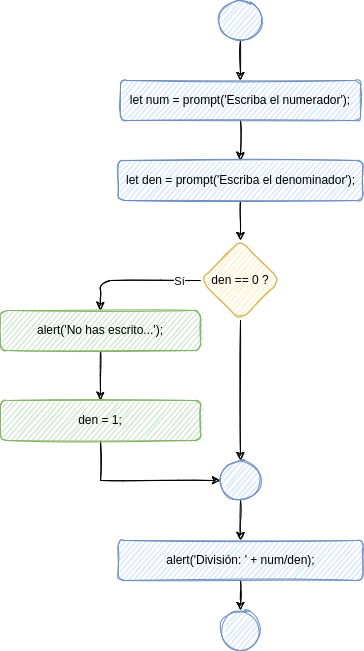

# Sentencia if/else

La sentencia `if/else` es una sentencia condicional, mediante la cual le decimos al ordenador que compruebe una condición, y ejecute cierto bloque de sentencias en caso de que se cumpla, y otro bloque distinto en caso de que no se cumpla.


## Sintaxis

La sintaxis de la sentencia if/else es la siguiente:

```javascript
if (condición) {
    ejecutar_si_se_cumple;
}
else {
    ejecutar_si_no_se_cumple;
}
```

Observa que:

-   la condición se escribe entre **paréntesis**;
-   las sentencias se escriben entre **llaves**;
-   después de `else` no hay que escribir ninguna condición (es la misma que la que ya hemos escrito después de `if`).


## Ejemplo

```javascript
let x = prompt('Cuál es su nota?');
if (x < 5) {
    alert('Suspenso');
}
else {
    alert('Aprobado');
}
```

El diagrama de flujo correspondiente sería el siguiente:


