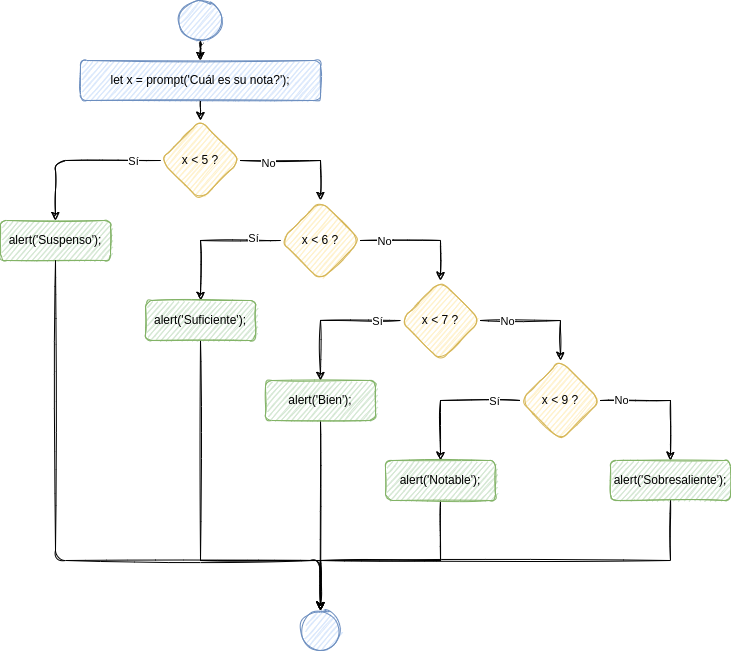
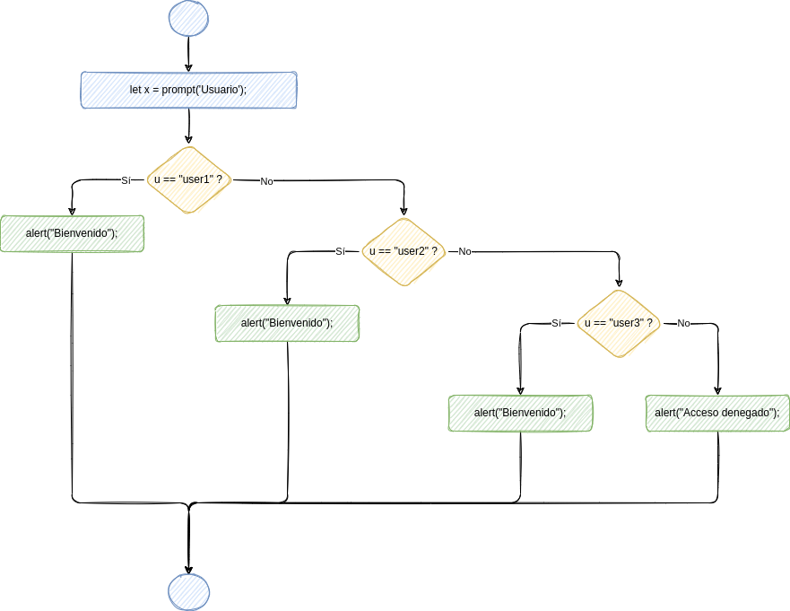
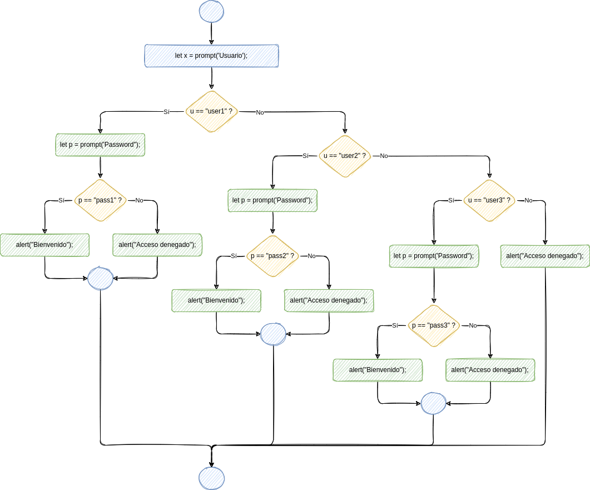

# Sentencia if/else if/else

:::info

La sentencia `if/else if/else`<sup><a id="fnr.1" class="footref" href="#fn.1" role="doc-backlink">1</a></sup> es una sentencia condicional mediante la que le decimos la ordenador que compruebe cierta condición y ejecute un bloque de sentencias en el caso de que dicha condición se cumpla. En caso de que no se cumpla, debe comprobar otra condición, y ejecutar otro bloque de sentencias si esta segunda condición se cumple. Si no, seguirá comprobando condiciones. Al final, si ninguna de las condiciones comprobadas se cumple, se ejecutará el bloque de sentencias especificado para ese caso.

:::


## Sintaxis

La sintaxis de la sentencia `if/else if/else` es la siguiente:

```javascript
if (condición) {
    ejecutar_si_se_cumple_cond1;
}
else if (condición2) {
    ejecutar_si_no_se_cumple_cond1_pero_sí_cond2;
}
else {
    ejecutar_si_no_se_cumple_ninguna_condición;
}
```

Observa que:

-   las condiciones se escriben entre **paréntesis**;
-   las sentencias se escriben entre **llaves**;
-   puede haber tantos bloques `else if` como queramos;
-   después de `else` no hay condición (la condición es que no se haya cumplido ninguna de las anteriores);
-   el bloque `else` del final es opcional.


## Ejemplo

```javascript
let x = prompt('Cuál es su nota?');
if (x < 5) {
    alert('Suspenso');
}
else if (x < 6) {
    alert('Suficiente');
}
else if (x < 7) {
    alert('Bien');
}
else if (x < 9) {
    alert('Notable');
}
else {
    alert('Sobresaliente');
}
```

El diagrama de flujo correspondiente sería el siguiente:



Es importante entender que cada comprobación `else if` se realiza después de que las anteriores hayan dado resultado negativo (si no, no se realizan). Por lo tanto, el bloque subsiguiente se ejecuta cuando se cumple la condición correspondiente **y no se ha cumplido ninguna de las anteriores**.


## Ejercicios

1.  📝 Dibuja el diagrama de flujo correspondiente al siguiente código:
    
    ```javascript
    let x = prompt("Escriba un número");
    if (x < 0) {
      console.log("Negativo");
    }
    else if (x > 0) {
      console.log("Positivo");
    }
    else {
      console.log("Nulo");
    }
    ```

2.  📝 Dibuja el diagrama de flujo correspondiente al siguiente código:
    
    ```javascript
    let u = prompt("Usuario");
    if (u == "user1") {
      console.log("Bienvenido, user1");
    }
    else if (u == "user2") {
      console.log("Bienvenido, user2");
    }
    else if (u == "user3") {
      console.log("Bienvenido, user3");
    }
    ```

3.  📝 💻 Escribe el código correspondiente al siguiente diagrama de flujo:
    
    

4.  📝 💻 Escribe el código correspondiente al siguiente diagrama de flujo:
    
    

5.  📝 💻 Simplifica el siguiente código, utilizando una sentencia `if/else if/else`:
    
    ```javascript
    if (talla === "S") {
      console.log("Small");
    }
    else {
      if (talla === "M") {
        console.log("Medium");
      }
      else {
        if (talla === "L") {
          console.log("Large");
        }
        else {
          if (talla === "XL") {
            console.log("Extra-Large");
          }
          else {
            console.log("Talla desconocida");
          }
        }
      }
    }
    ```

6.  📝 💻 Escribe la siguiente sentencia `if/else if/else` mediante sentencias `if/else` *anidadas* (es decir, que unas están dentro de otras):
    
    ```javascript
    if (d === "L") {
      console.log("lunes");
    }
    else if (d === "M") {
      console.log("martes");
    }
    else if (d === "X") {
      console.log("miércoles");
    }
    else if (d === "J") {
      console.log("jueves");
    }
    else if (d === "V") {
      console.log("viernes");
    }
    else if (d === "S") {
      console.log("sábado");
    }
    else if (d === "D") {
      console.log("domingo");
    }
    else {
      console.log("Día desconocido");
    }
    ```

7.  📝 💻 ¿Cuál será el valor de `x` al terminar de ejecutarse el siguiente código?
    
    ```javascript
    let x = 1;
    if (x < 0) {
      x = x + 1;
    }
    else if (x < 1) {
      x = x + 1;
    }
    else if (x < 2) {
      x = x + 1;
    }
    else {
      x = 9;
    }
    ```

8.  📝 💻 ¿Para qué valores de `x` se obtendrá el mensaje `Premio!`?
    
    ```javascript
    if (x < 0) {
      console.log("Sigue buscando");
    }
    else if (x > 100) {
      console.log("Te acercas...");
    }
    else if (x < 50) {
      console.log("Casi, casi...");
    }
    else if (x < 75) {
      console.log("Premio!");
    }
    else {
      console.log("Otra vez será");
    }
    ```

## Footnotes

<sup><a id="fn.1" class="footnum" href="#fnr.1">1</a></sup>

 En realidad, la sentencia `if/else if/else` no es una sentencia distinta de la sentencia `if/else`. Lo que ocurre es que, en la sentencia `if/else` cuando un bloque de sentencias (el correspondiente a `true` o el correspondiente a `false`) tiene una única sentencia, no es necesario escribirlo entre llaves. Por lo tanto, la sentencia `if/else if/else` no es más que una sentencia `if/else` que tiene una sentencia `if/else` dentro del bloque correspondiente a `false` (es decir, en el bloque `else`). Nótese que, sintácticamente, la palabra `else` pertenece siempre a la sentencia `if` inmediatamente anterior. En los ejercicios 5 y 6 puede apreciarse cómo la sintaxis `else if` simplifica las cosas.
